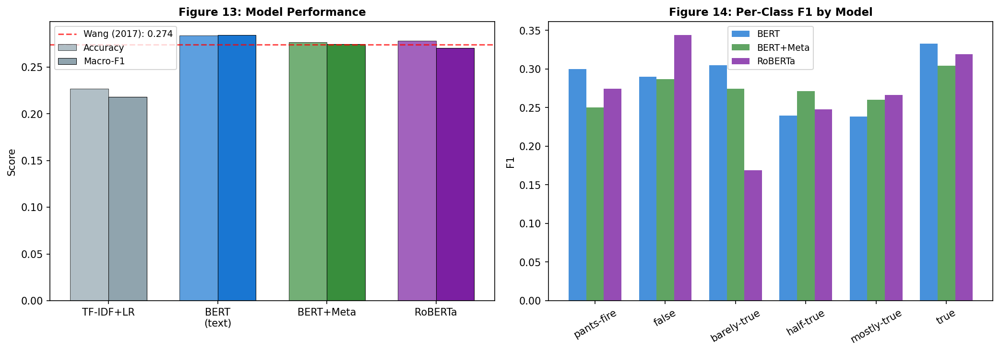

<div align="center">

# 🛰️ Veracity.ai

### Fine-Grained Misinformation Detection with Transformer Language Models

*Can a machine tell how true a political statement is? This project finds out — across six levels, from **True** to **Pants&nbsp;on&nbsp;Fire**.*

<br/>


[](https://veracity-bert-liar.vercel.app/)

**[🌐 Live Demo](https://veracity-bert-liar.vercel.app/)** ·
**[📄 Final Report](report/Rahul_Mishra_453_P4_Final_Report.pdf)** ·
**[📓 Notebook](notebook/Rahul_Mishra_453_P4_Notebook.ipynb)** ·
**[🤗 Model Weights](https://huggingface.co/adityarajmishra/veracity-bert-liar)** ·
**[🔌 API Guide](webapp/API.md)**

</div>

---

## ✨ Overview

**Veracity.ai** is an open-source NLP system that classifies the truthfulness of a
political or news statement on a **six-level ordinal scale** using a fine-tuned
**BERT** model trained on the **LIAR** benchmark. Unlike the common binary
"real vs. fake" approach, it mirrors how professional fact-checkers actually
reason — distinguishing *pants-fire*, *false*, *barely-true*, *half-true*,
*mostly-true*, and *true*.

The project spans the **entire ML lifecycle**: data acquisition → exploratory
analysis → preprocessing → model design → training → rigorous evaluation →
interpretive analysis → and a **production-grade, deployable web application**
with a typed React UI and a monitored FastAPI inference service.

> 🧠 **The headline insight:** raw accuracy (≈0.28 on six classes) tells only
> half the story. **44.5% of all errors are between *adjacent* veracity
> levels** — proof the model learned the latent "truth scale" and that the
> ceiling is driven by genuine label ambiguity, not model weakness.

---

## 🎯 The Problem & Why It's Hard

Automated misinformation detection is a pressing societal need — fabricated
claims spread faster than fact-checkers can respond. This project tackles the
*hard* version of the task, which surfaces three intertwined challenges:

| Challenge | Why it matters |
|---|---|
| 🪜 **Ordinal label ambiguity** | The boundary between *half-true* and *mostly-true* is editorial judgment, not objective truth — irreducible label noise caps achievable accuracy. |
| ✂️ **Short-text representation** | LIAR statements average **< 20 tokens**, starving the model of context. |
| ⚖️ **Class imbalance** | The rare *pants-fire* class has ~⅕ the examples of majority classes — yet it's the one we most want to catch. |

---

## 📊 Results

<div align="center">

| Model | Accuracy | Macro-F1 | Weighted-F1 |
|---|:---:|:---:|:---:|
| TF-IDF + Logistic Regression | 0.227 | 0.218 | 0.226 |
| **🏆 BERT (text-only)** | **0.284** | **0.284** | **0.280** |
| BERT + Metadata Fusion | 0.277 | 0.274 | 0.277 |
| RoBERTa (text-only) | 0.278 | 0.270 | 0.271 |
| _Wang (2017) baseline_ | _0.274_ | _—_ | _—_ |
| **BERT on WELFake (binary)** | **0.988** | **0.988** | **—** |

</div>

Fine-tuned BERT beats the lexical baseline and the original LIAR benchmark, and
sits far above the 0.167 random-choice floor. The **same architecture scores
98.8% on the cleaner binary WELFake task** — a controlled contrast proving the
LIAR ceiling is data-driven, not a model defect.

<div align="center">

<br/><em>Model performance and per-class F1 across all four models.</em>
</div>

---

## 🏗️ Architecture

A deliberate progression from shallow lexical features to deep contextual
representations and multi-modal fusion:

```
                          ┌──────────────────────────────────────────┐
   "Crime rose 500%..."   │  ① TF-IDF + Logistic Regression (floor)   │
            │             ├──────────────────────────────────────────┤
            ▼             │  ② BERT  →  [CLS] (768-d)  →  6 logits     │ ★ best
   ┌─────────────────┐    ├──────────────────────────────────────────┤
   │  Tokenize +     │ →  │  ③ Dual-stream fusion:                    │
   │  normalize      │    │     text [CLS] ⊕ speaker metadata (29-d)  │
   └─────────────────┘    ├──────────────────────────────────────────┤
                          │  ④ RoBERTa  →  [CLS]  →  6 logits         │
                          └──────────────────────────────────────────┘
                                            │
                                            ▼
                            softmax → 6-class probability distribution
```

**Key design choices:** class-weighted cross-entropy (so rare classes aren't
ignored) and **macro-F1** as both metric *and* early-stopping criterion (so
accuracy can't be inflated by predicting only majority classes).

---

## 🖥️ The Web Application

A full-stack, deployable product — not just a notebook:

- ⚛️ **Frontend** — React 18 + TypeScript + Vite + Tailwind + Framer Motion.
  Animated confidence gauge, gradient probability chart, light/dark theme,
  fully responsive, and a **Stripe-style interactive API reference**.
- 🚀 **Backend** — FastAPI with structured logging, request-correlation IDs,
  in-process metrics, **per-IP rate limiting**, **security headers**, and
  CORS lockdown. Auto-downloads model weights from the 🤗 Hub on first boot.

```
┌──────────────────────────┐   HTTPS    ┌───────────────────────────┐
│  React SPA (Vercel)      │ ─────────▶ │  FastAPI + PyTorch (Render)│
│  veracity-…vercel.app    │            │  /predict · /docs · /health │
└──────────────────────────┘            └───────────────────────────┘
```

---

## 🚀 Quick Start

> 🌐 **Try it live — no setup required:** **[veracity-bert-liar.vercel.app](https://veracity-bert-liar.vercel.app/)**

### Run the full app (one command)

```bash
cd webapp
npm run install:all     # installs root + frontend + backend dependencies
npm run dev             # backend → :8000   frontend → :5173
```

Open **http://localhost:5173**. The status pill turns green once the model
loads. Weights are read from `models/`; if absent they auto-download from the
[Hugging Face Hub](https://huggingface.co/adityarajmishra/veracity-bert-liar).

### Reproduce the research

```bash
pip install torch transformers scikit-learn pandas numpy matplotlib seaborn jupyter
jupyter notebook notebook/Rahul_Mishra_453_P4_Notebook.ipynb
```

The notebook uses a **load-or-train** pattern: cached weights are loaded if
present, otherwise models train from scratch (≈2 h on Apple-Silicon MPS).

---

## 🔌 Consume the API

No API key required — open access within fair-use rate limits.

```bash
curl -X POST "http://127.0.0.1:8000/predict" \
  -H "Content-Type: application/json" \
  -d '{"statement": "Crime rose 500% in the last two years."}'
```

```json
{
  "prediction": "pants-fire",
  "prediction_display": "Pants on Fire",
  "confidence": 0.79,
  "probabilities": { "pants-fire": 0.79, "false": 0.09, "...": "..." },
  "model_used": "BERT + Metadata Fusion",
  "latency_ms": 11.5
}
```

📖 Full reference: **[webapp/API.md](webapp/API.md)** · interactive docs at `/docs`.

| Endpoint | Description |
|---|---|
| `POST /predict` | Classify a statement (optional speaker metadata) |
| `GET /health` | Liveness + model-loaded + device |
| `GET /labels` | The six veracity classes |
| `GET /metrics` | Uptime, request counts, model performance |
| `GET /api-info` | License, rate limits, usage policy |

---

## 📁 Repository Structure

```
veracity-bert-liar/
├── 📄 report/        Final report (PDF + HTML) and prior milestone PDFs
├── 📓 notebook/      Executed Jupyter notebook (.ipynb + .html)
├── 🧠 models/        Model config + metrics (weights on 🤗 Hub)
├── 📊 datasets/      LIAR benchmark (+ WELFake download guide)
├── 🖼️ figures/       All EDA + results figures
└── 🖥️ webapp/        Monorepo: FastAPI backend + React/TS frontend
    ├── backend/      Layered API: routes, services, security, tests
    └── frontend/     React SPA with Stripe-style API docs
```

---

## 🔬 Methodology Highlights

- **Datasets:** LIAR (12,836 statements, 6-class) + WELFake (~72k articles, binary).
- **Preprocessing:** Unicode NFD + lowercase → WordPiece/BPE (128 tokens);
  party one-hot + L2-normalized credit-history → 29-d metadata vector.
- **Training:** AdamW (lr 2e-5), 10% linear warmup, gradient clipping, early
  stopping on validation macro-F1 (patience 3).
- **Evaluation:** accuracy, macro/weighted-F1, per-class breakdown, confusion
  matrices, and an **ordinal-distance error analysis**.

### 💡 Breakthrough Findings

1. **Error structure > aggregate score.** 44.5% of errors are one ordinal step;
   only 2% are maximal (5-step) errors — the model learned the truth scale.
2. **The ceiling is the data, not the model** — proven by the LIAR (0.28) vs.
   WELFake (0.99) contrast on identical code.
3. **Aggregate signal ≠ instance utility** — speaker metadata that separates
   classes in the mean *slightly hurt* per-statement prediction (overfitting).
4. **Better pre-training ≠ better results** when a task is *label-limited*
   rather than *representation-limited* (RoBERTa did not beat BERT here).

---

## 🛡️ Responsible Use

Predictions are **probabilistic estimates, not authoritative fact-checks.**
The model classifies **text, not people**, and must not be used to assert that
any individual has lied. It is designed as a **human-in-the-loop triage tool**.

---

## 📚 Key References

- Wang, W. Y. (2017). *"Liar, Liar Pants on Fire": A New Benchmark Dataset for Fake News Detection.* ACL.
- Devlin et al. (2019). *BERT: Pre-training of Deep Bidirectional Transformers.* NAACL-HLT.
- Liu et al. (2019). *RoBERTa: A Robustly Optimized BERT Pretraining Approach.* arXiv:1907.11692.
- Verma, Agrawal & Patel (2021). *WELFake.* IEEE TCSS 8(4).

---

## 👤 Author

**Rahul Mishra** — MS Data Science, Northwestern University
*AI and Natural Language Processing*

<div align="center">

📜 **MIT License** · Built with PyTorch · 🤗 Transformers · FastAPI · React

*If this project helped you, consider giving it a ⭐*

</div>
